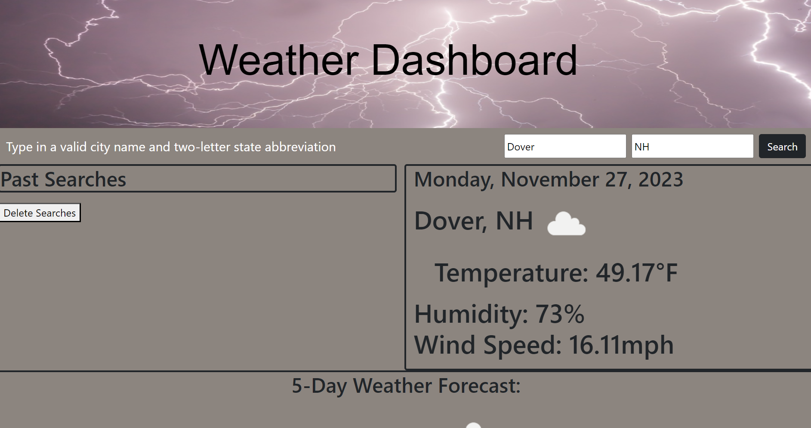

## Name
Weather Application

## Description
This weather application allows a user to search any location within the United States and get current weather conditions as well as a 5-day forecast for that location. Once a location is searched, the program then add a button of that location to the previously searched list. This button can then be clicked at any time to return to the weather search results for that location.

## Badges
N/A

## Visuals

## Installation
N/A

## Usage
In order to use this application, the user only needs to enter the name of a town or city in the first search box and the two letter abbreviation of the state in the second search box and click search. The program then uses the Open Weather API to find that locations latitude and longitude coordinates which then plug into a current weather search and a 5-day weather search. Once this search has been completed, the program then displays these results for the user to see.

Link to deployed application: https://ida-whit.github.io/Weather-Application/

## Support
N/A

## Roadmap
N/A

## Authors and acknowledgment
This program was written and tested by myself, Ida Whitcomb, with help from the AskBCS learning assitants.

This program uses the API program from Open Weather Map (https://openweathermap.org/current)

Image shown at the top of the page is a free download from Pixabay (https://pixabay.com/illustrations/sunset-sea-horizon-ocean-seascape-473604/)